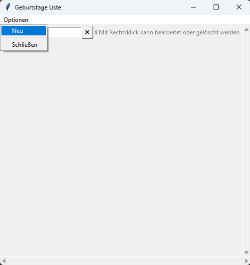
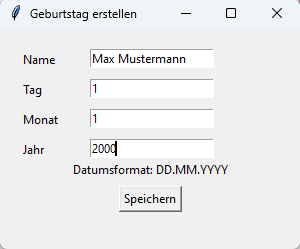
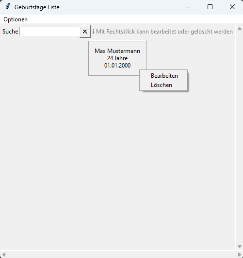
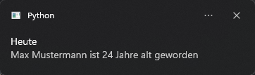

# Geburtstage Benachrichtigung

## Inhaltsverzeichnis
1. [Beschreibung](#beschreibung)
2. [Verwendung](#verwendung)
3. [Anleitung](#anleitung)
   + [Autostart](#autostart)
4. [Beispiel](#beispiel)
5. [Voraussetzung](#voraussetzung)
   + [plyer](#plyer)
6. [Autor](#autor)
7. [Lizenz](#lizenz)

## Beschreibung
Mit dieser Anwendung können Geburtstage gespeichert werden. Einmal täglich wird eine Benachrichtigung angezeigt,
ob eine Person an diesem Tag Geburtstag hat.

## Verwendung
Die main.py Datei ausführen. In dem Fenster kann man unter Optionen einen neuen Geburtstag eintragen oder in der Sammlung
bereits gespeicherte Geburtstage bearbeiten oder löschen. Die autostart.py Datei kann dafür verwendet werden,
wenn das Programm bei einem PC Start automatisch ausgeführt werden soll.

## Anleitung
Die main.py Datei ausführen und es erscheint ein leeres Fenster mit einer Suche. In der Menüleiste ist es möglich einen
neuen Geburtstag einzutragen.



In dem neuen Fenster können die erforderlichen Daten eingetragen und im Anschluss gespeichert werden.



Falls es notwendig ist, kann der Geburtstag bearbeitet oder gelöscht werden.




### Autostart
1. Mit den Tasten Windows&#x229E; + R das "Ausführen" Fenster öffnen
2. Den Befehl shell:startup eingeben und mit OK bestätigen
3. In das geöffnete Fenster eine Verknüpfung der autostart.py Datei erstellen

## Beispiel
Wenn die Schritte in dem Punkt [Anleitung](#anleitung) befolgt wurden, dann wird nach dem Öffnen von dem Program überprüft,
ob eine Person am heutigen oder am morgigen Tag Geburtstag hat.




## Voraussetzung
+ plyer

### plyer
In die Kommandozeile wird der folgende Befehl eingetragen:
```shell
pip install plyer
```
Die Ausgabe in der Kommandozeile sollte folgende sein (Stand 30.03.2024):
```shell
Collecting plyer
  Using cached plyer-2.1.0-py2.py3-none-any.whl.metadata (61 kB)
Using cached plyer-2.1.0-py2.py3-none-any.whl (142 kB)
Installing collected packages: plyer
Successfully installed plyer-2.1.0
```

## Autor
[](https://github.com/PixelPilot24)

## Lizenz
[MIT](https://choosealicense.com/licenses/mit/)