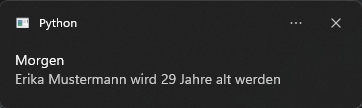

# Geburtstage Benachrichtigung

## Inhaltsverzeichnis
1. [Beschreibung](#beschreibung)
2. [Verwendung](#verwendung)
3. [Anleitung](#anleitung)
   + [Autostart](#autostart)
4. [Beispiel](#beispiel)
5. [Voraussetzung](#voraussetzung)
   + [plyer](#plyer)
6. [Autor](#autor)
7. [Lizenz](#lizenz)

## Beschreibung
Mit dieser Anwendung können Geburtstage gespeichert werden. Einmal täglich wird eine Benachrichtigung angezeigt,
ob eine Person an diesem Tag Geburtstag hat.

## Verwendung
Die main.py Datei ausführen. Man wird zu einem Fenster weitergeleitet, indem der Name
und das Geburtsdatum eingetragen wird. Die autostart.py Datei kann dafür verwendet werden,
wenn das Programm bei einem PC Start automatisch ausgeführt werden soll.

## Anleitung
Die main.py Datei ausführen und dort sieht man leere Felder, in die man die entsprechenden Daten eintragen soll.


Wenn die Daten korrekt eingetragen wurden, erscheint im unteren Rand des Fensters eine Benachrichtigung, das die Daten
erfolgreich gespeichert wurden.


Falls die Daten gelöscht oder angeschaut werden sollen, dann geht das über die Menüleiste unter "Option"
und "Geburtstage löschen".


Danach erscheint ein weiteres Fenster, indem die Löschung vorgenommen werden kann. 


### Autostart
1. Mit den Tasten Windows&#x229E; + R das "Ausführen" Fenster öffnen
2. Den Befehl shell:startup eingeben und mit OK bestätigen
3. In das geöffnete Fenster eine Verknüpfung der autostart.py Datei erstellen

## Beispiel
Wenn die Schritte in dem Punkt [Anleitung](#anleitung) befolgt wurden, dann wird nach dem Öffnen von dem Program überprüft,
ob eine Person am heutigen oder am morgigen Tag Geburtstag hat.




## Voraussetzung
+ plyer

### plyer
In die Kommandozeile wird der folgende Befehl eingetragen:
```shell
pip install plyer
```
Die Ausgabe in der Kommandozeile sollte folgende sein (Stand 30.03.2024):
```shell
Collecting plyer
  Using cached plyer-2.1.0-py2.py3-none-any.whl.metadata (61 kB)
Using cached plyer-2.1.0-py2.py3-none-any.whl (142 kB)
Installing collected packages: plyer
Successfully installed plyer-2.1.0
```

## Autor
[](https://github.com/PixelPilot24)

## Lizenz
[MIT](https://choosealicense.com/licenses/mit/)